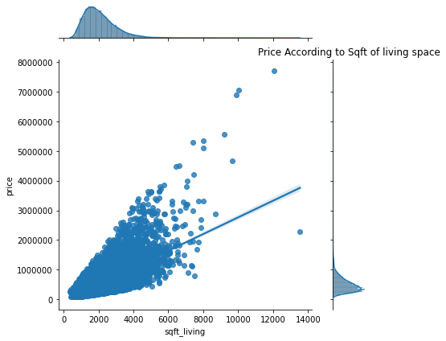
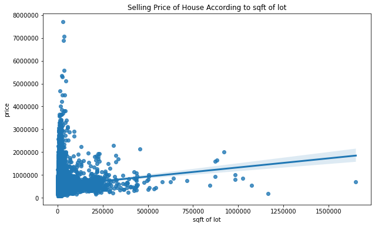
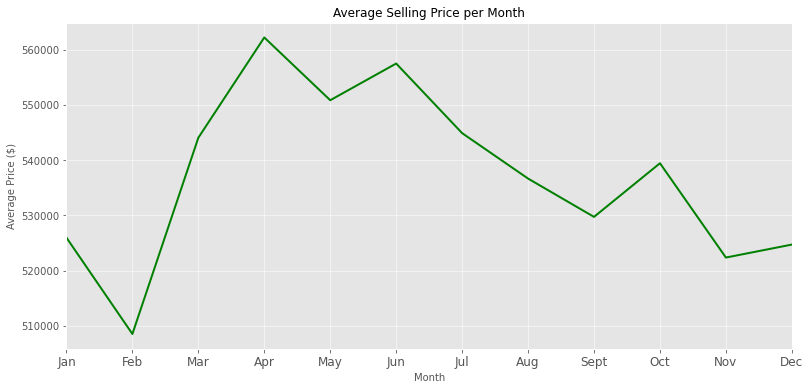
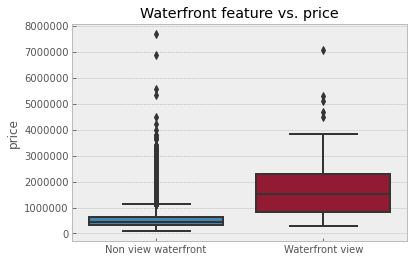

# King County House Sales - Project 2


**Author**: Annie Liu

## Overview

King County Real Estate agency want to provide advice to homeowners or potential buyers about how certain homes might increase the estimated value of these homes. This project analyses different features such as living space, grade or whether the property has waterfront views, as well as the time of sale which could affect the property price value.
From this, we put forward the following recommendations to King County Real Estate to consider when advising their clients:

* Data shows that greater the interior living space (sqft_living), higher the property value.

* The average highest selling price was between April and June, with February the lowest. 

* Properties that had waterfront views were evidently more expensive than non-waterfront views.

We included these features to predict house prices based on unseen testing data. Feature selection to determine which model predicted most accurately. 

## Business Problem

We ask the following questions to help King County to better advise their clients.

***
Questions considered:
* What are the business's pain points related to this project?

King County need to be able to provide factual evidence of what homes are likely to generate greater return for homeowners/buyers. By understanding this, King County clients will be more confident in their renovation or buying decisions.
We look price as the constant variable and assess which features have greater impact on price to aid us in solving this.

* How did you pick the data analysis question(s) that you did?

Interior living space (Sqft_living), overall (quality, construction and design level) grade given to each home (grade) and typically homes that have waterfront views are more expensive (waterfront). These all seem like reasonable factors that could impact the price of a property.

* Why are these questions important from a business perspective?

By answering these questions, King County can make better assumptions with their clients on the types of properties to invest in, or features to add/remote and how to when to buy or sell.

***

## Data

One data (kc_house_data) was used for this analysis.

***
Questions considered:

* Where did the data come from, and how do they relate to the data analysis questions?

Kc_house_data represents property data; price, date home was sold, price sold, no. of bedrooms and bathrooms, square ft living space, square ft of land space, no. of floors, waterfront view, condition, grade, sq ft of interior housing space (exl. basement), sq ft of basement, year built, year renovated, zipcode, latitude and longitude coordinates, sq ft of interior housing living space of nearest 15 neighbours and sq ft of the land lots of nearest 15 neighbours.

We targeted the following variables: sqft_living, sqft_lot, date and waterfront against price.

***

## Methods

Preparation, analysis and modelling the data.

***

Data was imported and performed exploratory data analysis and visualisations. Removed outliers, created a 'month_sold' column from 'date'.

Made assumptions on linear regression and assessed if any correlations between price and nominated features.

Feature engineering that could help with final model predictions. Made hypotheses based on selected features against target variable (price); month_sold, age of property and waterfront.

Model with Train-test split to assess model fitment to data. We use a baseline to find the worst fit to compare against the models later.

Model 1 adopted most features that would impact price, we assessed the fitment and prediction then use feature selection to drop features.

Determined R-Squared and feature coeffiecients, used Sklean to fit model to training data. Predict on y and find RMSE for model performance on training data. Applied same on testing data and generate RMSE. RMSE comparison between the two data sets and determine which is underfit/overfit.

Applied feature selection to create another iteration of model 2 and improve RMSE, dropped grade as it seemed to have highest correlations. 

Final model we can generalize it on the holdout set housing_features.csv. The model's predictions were also exported as `housing_predictions.csv'.

***

## Results

Interpreting the results.

***

We found that  most house prices were sub $1 mil.

By interpreting the results, we found that living space had high correlations with price. So greater the living space, higher the property price. Land space had no visible correlations surprisingly. 

February had lowest house price sales, with highest prices in April to June.

We also found that properties with waterfront views cost more than non waterfronts.

Our generalizations have good grounding based off the data we have and therefore can aid to King County Real Estate to better advise their clients. There is a mammoth amount of data, we have used data that may have been sold more than once. Filled null values with median and dropped unncessary columns. There were also data that 33 bedrooms  which seems unreasonable given the size of the property, we had a closer look and most properties were between 1-6 bedrooms. So we removed some unlikely bedroom data.

***

### Visualizations



Living space has high relationship with property prices.



Land of space has no visible relationship with prices.



Seasonality vs Price (Feb being lowest selling price, with highest between April and June.



Non waterfront vs. Waterfront (where waterfront properties are valued for more).


## Conclusions

In this analysis we made broad some initial assumptions to help define our questions and find our answers. 
Whilst we can generalize that these features can impact property prices, there are many other factors which can contribute to the data. For example, an interest hike or economic recession in the market could likely impact these trends.
Therefore, these are predictions based upon the statistical data we have been provided with.

From the results in our analysis, we recommend the following:

#### Recommendation 1

Look for larger living spaces for greater return on properties.

#### Recommendation 2

Buy during lower months such as February, and sell during higher months April to June.

#### Recommendation 3

Ideally invest in waterfront properties (over non waterfront).


### Next Steps

There could be other variables that King County might be interested in, such as location. Perhaps there are certain catchment/locales that perform better than others depending on the types of amenities and facilities available.

These are all factors that can influence our current data. Having a bigger picture of the landscape, we can drill down further. 

***

## For More Information

Please review our full analysis in [our Jupyter Notebook](./King-County-House-Sales.ipynb) or our presentation (./King County House Sales_Presentation.pdf).

For any additional questions, please contact **Annie Liu at annieliu1989@yahoo.com**

## Repository Structure

Describe the structure of your repository and its contents, for example:

```
├── data                           
├── images         
├── King-County-House-Sales.ipnb    
├── King County House Sales_Presentation.pdf	              
├── Notebook.pdf				          
├── README.md                        
├── Github.pdf
```